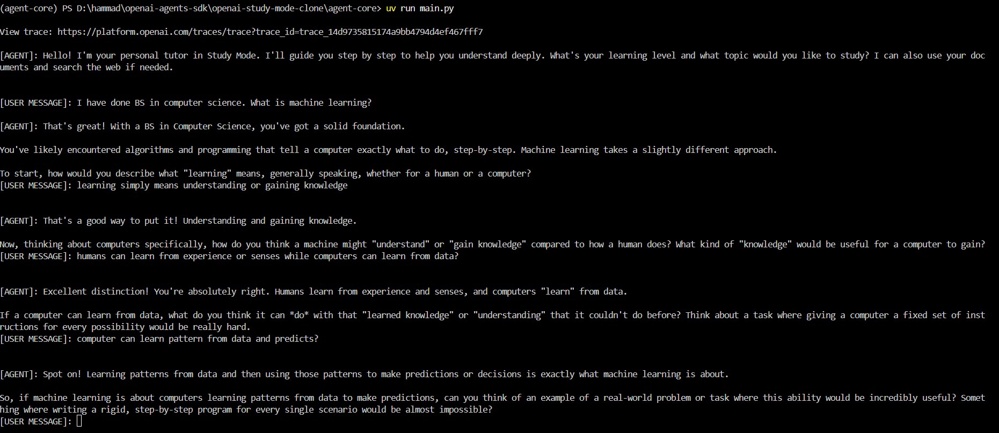
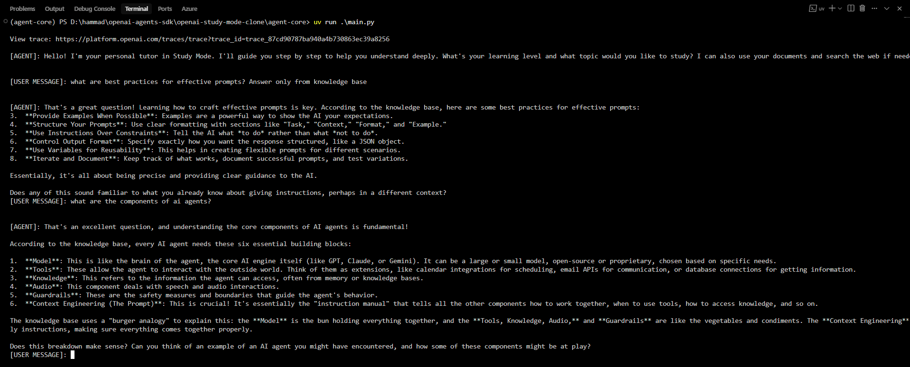
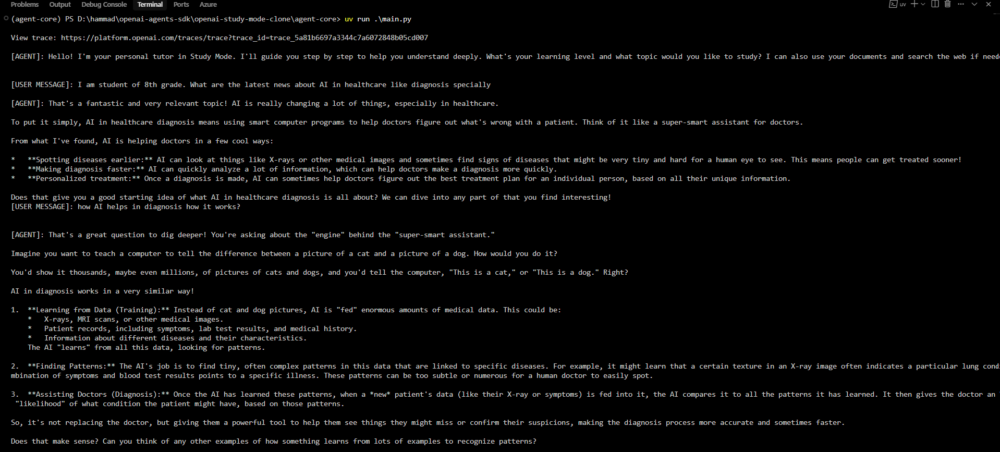

# OpenAI Study Mode Clone

> An intelligent AI tutoring system that uses Socratic teaching methods to guide students through personalized learning experiences.

[](https://www.python.org/downloads/)
[](https://github.com/openai/agents-sdk)
[](https://modelcontextprotocol.io/)
[](https://ai.google.dev/)

## 🎯 Overview

This project implements an AI-powered study assistant that follows Socratic teaching principles. Instead of providing direct answers, it guides students through questions and hints to help them discover solutions themselves. The system combines document-based knowledge retrieval with real-time web search capabilities.

### Key Features

- **🧠 Socratic Teaching**: Guides learning through questions rather than direct answers
- **📚 Document Knowledge Base**: Vector-based search through educational materials
- **🌐 Web Search Integration**: Real-time information retrieval via DuckDuckGo
- **🎯 Source Control**: Specify whether to use knowledge base only, web search, or both
- **💬 Interactive Sessions**: Persistent conversation history and context
- **🔌 MCP Architecture**: Modular design using Model Context Protocol
- **⚡ Google Gemini Powered**: Advanced language understanding and generation

## 🏗️ Architecture

The system consists of two main components:

```
openai-study-mode-clone/
├── agent-core/          # Main tutoring agent (OpenAI Agents SDK)
│   ├── main.py         # Agent runner and session management
│   └── pyproject.toml  # Dependencies and configuration
└── mcp-server/         # Knowledge and search server (FastMCP)
    ├── server.py       # MCP server with tools and prompts
    ├── build_vector_store.py  # Vector database builder
    └── knowledge-base/ # Educational document storage
```

### Component Details

**Agent Core**
- Built with OpenAI Agents SDK
- Implements Socratic teaching methodology
- Manages conversation sessions and context
- Connects to MCP server for knowledge retrieval

**MCP Server**
- FastMCP-based server providing tools and prompts
- Vector search using ChromaDB + Google Gemini embeddings
- DuckDuckGo web search integration
- System prompt management for study mode

## 🚀 Quick Start

### Prerequisites

- Python 3.13+
- [uv package manager](https://github.com/astral-sh/uv)
- Google Gemini API key

### Installation

1. **Clone the repository**:
   ```bash
   git clone https://github.com/DevHammad0/openai-study-mode-clone.git
   cd openai-study-mode-clone
   ```

2. **Set up MCP Server**:
   ```bash
   cd mcp-server
   uv sync
   
   # Create .env file
   echo "GEMINI_API_KEY=your_gemini_api_key_here" > .env
   
   # Build vector store (required first time)
   uv run build_vector_store.py
   
   # Start MCP server
   uv run server.py
   ```
   
   > ⚠️ **Important**: The vector store is not included in the repository. You must run `build_vector_store.py` before starting the server for the first time.

3. **Set up Agent Core** (in a new terminal):
   ```bash
   cd agent-core
   uv sync
   
   # Create .env file
   echo "GEMINI_API_KEY=your_gemini_api_key_here" > .env
   echo "MCP_SERVER_URL=http://localhost:8000" >> .env
   
   # Run the agent
   uv run main.py
   ```

### Getting Your Google Gemini API Key

1. Visit [Google AI Studio](https://aistudio.google.com/apikey)
2. Create a new API key
3. Add it to your `.env` files in both directories

## 💡 Usage

Once both components are running:

1. **Start a session**: The agent will greet you and ask about your learning level
2. **Ask questions**: Pose any topic you want to study
3. **Interactive learning**: The agent will guide you with questions and hints
4. **Specify sources**: Use "answer only from knowledge base" for document-based responses
5. **Web search**: Request current information when needed
6. **Exit**: Type `exit` or `quit` to end the session

### 📸 Demo Screenshots

Here are real interactions showing the AI tutor in action:

#### 1. Interactive Learning Session

*Socratic teaching in action - guiding through questions rather than direct answers*

#### 2. Knowledge Base Search

*Using "answer only from knowledge base" to search uploaded documents*

#### 3. Web Search in Action

*Agent searching the web for current information and real-time data*


### Controlling Information Sources

You can explicitly control which information sources the agent uses for your queries:

**📚 Knowledge Base Only:**
```
"Explain prompt engineering, answer only from knowledge base"

```

**🌐 Web Search Priority:**
```
"What are the latest developments in AI?"
"Find current news about quantum computing"
```

**🔄 Built-in/Mixed Sources (Default):**
```
"Help me understand machine learning"
"Explain photosynthesis step by step"
"How do neural networks work?"
```

> **💡 Pro Tip**: Always explicitly specify "answer only from knowledge base" when you want the agent to search your uploaded documents. This ensures the response comes exclusively from your curated materials.

## 📚 Knowledge Base

The system includes educational documents in the `mcp-server/knowledge-base/` directory:

- **Context Engineering Tutorial**: Guide for AI agent context engineering
- **Prompt Engineering Tutorial**: Comprehensive prompt engineering guide

### Adding New Documents

1. Create a `.txt` file in `mcp-server/knowledge-base/`
2. Add your educational content
3. Rebuild the vector store:
   ```bash
   cd mcp-server
   uv run build_vector_store.py
   ```
4. Restart the MCP server

## 🚨 Troubleshooting

### Common Issues

**"No such file or directory: vector_store"**
```bash
cd mcp-server
uv run build_vector_store.py
```

**"GEMINI_API_KEY is not set"**
- Ensure your `.env` file exists in the correct directory
- Verify your API key is valid at [Google AI Studio](https://aistudio.google.com/apikey)

**"Connection refused" when running agent**
- Ensure MCP server is running on `http://localhost:8000`
- Check that both components have the correct environment variables

**Vector store build fails**
- Verify internet connection (needed for Gemini API)
- Check that `knowledge-base/` directory contains `.txt` files
- Ensure sufficient disk space for ChromaDB
- **Check API quota limits** if using Gemini free tier (visit [Google AI Studio](https://aistudio.google.com/apikey) to check usage)

## 🛠️ Configuration

### Session Persistence

By default, conversations are stored in memory. For persistent sessions:

1. Edit `agent-core/main.py`
2. Uncomment line 32:
   ```python
   session = SQLiteSession("session_1", "conversations.db")
   ```

### MCP Server Settings

- **Host**: `127.0.0.1` (localhost only)
- **Port**: `8000`
- **Vector Store**: ChromaDB with Gemini embeddings
- **Chunk Size**: 900 characters with 100 character overlap

## 🔧 Development

### Project Structure

```
openai-study-mode-clone/
├── agent-core/
│   ├── main.py                 # Main agent runner
│   ├── pyproject.toml          # Python dependencies
│   └── README.md               # Component documentation
├── mcp-server/
│   ├── server.py               # FastMCP server
│   ├── build_vector_store.py   # Vector database builder
│   ├── knowledge-base/         # Document storage
│   ├── vector_store/           # ChromaDB files (auto-generated)
│   ├── pyproject.toml          # Python dependencies
│   └── README.md               # Component documentation
└── README.md                   # This file
```


## 📖 Resources

- [OpenAI Agents SDK](https://openai.github.io/openai-agents-python/) - Agent framework
- [Model Context Protocol](https://modelcontextprotocol.io/) - Server architecture
- [Google Gemini](https://ai.google.dev/) - Language model and embeddings
- [ChromaDB](https://www.trychroma.com/) - Vector database
- [LangChain](https://langchain.com/) - LLM application framework

---

**Built with ❤️ for better learning experiences**
